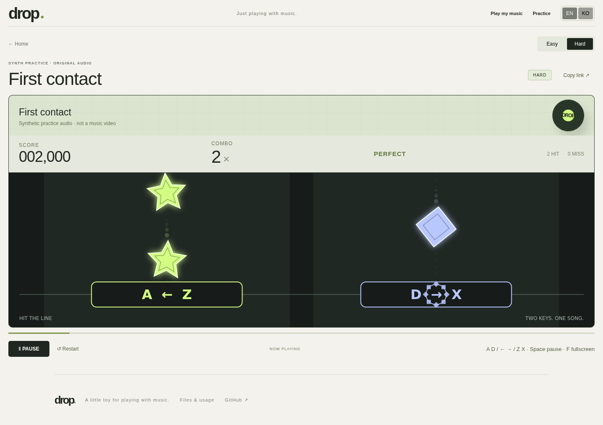

# DROP

**좋아하는 노래가 리듬게임에 없길래 만들었습니다.**

[English](README.md) · [한국어](README.ko.md)

음악 파일을 고르고 Easy 또는 Hard로 플레이하세요. 영상과 함께 보고 싶다면 영상 링크를 추가할 수 있습니다. 브라우저에서 로컬로 실행되며 음원 업로드와 채보 공개 게시 기능은 없습니다.

[잠깐 체험하는 데모](https://music-player.ludo-demo.com) · [내 음악으로 플레이](https://music-player.ludo-demo.com/create)

데모는 종료될 수 있습니다. 기본 사용 방식은 내 컴퓨터에서 실행하는 것입니다.



## 로컬 실행

**Node.js 22.22.2 이상**과 npm이 필요합니다. 최신 데스크톱 브라우저를 사용하세요. 테스트에는 Chromium을 사용했습니다.

```bash
git clone https://github.com/UTurtle/drop-music-game-player.git
cd drop-music-game-player
npm ci
npm run build
npm start
```

**http://127.0.0.1:51100**을 여세요. 종료는 `Ctrl+C`입니다. 위 npm 명령은 Windows·macOS·Linux에서 같은 방식으로 사용합니다. 자동 검증은 Linux와 Chromium에서 실행했습니다.

개발 중 자동 새로고침이 필요하면:

```bash
npm run dev
```

같은 포트의 기존 서버를 먼저 종료하세요. `DROP_PORT`로 포트를, `DROP_HOST`로 연결 주소를 바꿀 수 있습니다. 기본은 내 컴퓨터에서만 접근하는 `127.0.0.1`입니다. HTML 파일을 `file://`로 직접 열지는 마세요.

## 플레이

1. **내 음악으로 플레이**를 엽니다.
2. WAV·MP3·FLAC 파일을 선택합니다. 최대 50 MB, 1초~10분을 지원합니다.
3. 곡 제목을 입력합니다. 영상 링크는 선택 사항입니다.
4. **만들고 플레이**를 누르고 Easy 또는 Hard를 고릅니다.
5. **PLAY**를 누른 뒤 노트가 판정선에 닿을 때 키를 누릅니다.

| 동작 | 키 |
| --- | --- |
| 별 | `A`, `←`, `Z` 중 하나 |
| 마름모 | `D`, `→`, `X` 중 하나 |
| 일시정지 / 재개 | `Space` |
| 전체화면 | `F` · 종료 `Esc` |

EN / KO로 화면 언어를 전환합니다. 새로고침하지 않아 진행 중인 작업은 유지됩니다. 언어 선택만 브라우저에 저장됩니다.

데스크톱·가로 화면에서는 오른쪽에서 왼쪽으로, 휴대폰 세로 화면에서는 위에서 아래로 진행합니다. 별·마름모가 같은 윤곽에 겹칠 때 입력하세요. 터치 화면에서는 판정 도형을 눌러도 됩니다.

파일 없이 체험하려면 **연습**을 선택하세요. 코드로 합성한 자체 연습 음원을 사용합니다.

## 영상과 함께 플레이

현재 영상 링크는 **YouTube 공식 임베드 플레이어**를 지원합니다. 생성 후 **음악 파일 대신 연결한 영상으로 플레이**를 선택하세요. 영상 자체의 소리를 사용하며 로컬 음악과 동시에 섞어서 재생하지 않습니다. 인터넷 연결과 외부 재생이 허용된 영상이 필요합니다.

채보 생성에는 여전히 로컬 음악 파일이 필요합니다. 영상 다운로드·스트림 캡처·음원 추출은 제공하지 않습니다. 영상 도입부 길이가 다르면 오프셋을 조절할 수 있지만, 중간 삽입·삭제는 오프셋 하나로 맞출 수 없습니다.

## 음악과 데이터

- 파일 분석·채보 생성·재생은 브라우저 안에서 진행됩니다.
- 파일과 채보는 페이지 메모리에만 유지됩니다. **새로고침하거나 닫으면 작업이 사라집니다.** 저장된 보관함은 아직 없습니다.
- 계정·음원 업로드·채보 공개·랭킹·분석 추적 기능은 없습니다.
- 로컬 서버는 앱 파일을 제공합니다. 데이터베이스는 필요하지 않습니다.
- 선택적 영상 재생은 YouTube에 연결됩니다. 공개 데모의 연결 제공자는 일반적인 접속 정보를 처리할 수 있습니다. 로컬 파일 플레이에는 공개 데모가 필요하지 않습니다.
- 의존성 설치에는 인터넷이 필요합니다. 설치·빌드 후에는 로컬 서버를 실행한 상태로 인터넷 없이 음악 파일 플레이가 가능합니다.

## 기대할 수 있는 수준

v3 생성기는 어택의 음색·강약과 짧은 박자 묶음으로 연타를 포함한 패턴을 만듭니다. 같은 쪽 연속 입력은 Easy 최대 2회, Hard 최대 3회로 제한하며 매우 빠른 구간은 번갈아 배치합니다. 새 규칙을 적용하려면 기존 세션의 채보를 다시 생성하세요.

자동 채보는 DSP로 만든 초안입니다. 음악의 강조점을 놓치거나 반복적으로 느껴질 수 있습니다. 실제 곡의 재미와 싱크는 곡마다 다릅니다. 자동 테스트는 합성 음원과 모의 영상 이벤트를 사용합니다. 모델 학습은 하지 않으며, 사업용 서비스가 아닌 취미 프로젝트입니다.

직접 만든 음악 또는 필요한 이용 권한을 가진 파일을 사용하세요. MIT 라이선스는 이 프로젝트의 코드에 적용되며 **다른 사람의 음악·영상이나 플랫폼 사용 권한을 제공하지 않습니다.** 저작권이 있는 곡과 영상은 배포물에 포함하지 않습니다. 선택적 영상 재생에는 [YouTube 이용약관](https://www.youtube.com/t/terms)과 [Google 개인정보처리방침](https://policies.google.com/privacy)이 적용됩니다.

## 개발과 검증

```bash
npm test
npm run build
npx playwright install chromium
npm run test:v1
# 다른 터미널에 npm run dev 또는 npm start를 실행한 상태에서:
npm run test:e2e
```

`test:v1`은 5191 포트에 격리된 서버를 띄워 실제 WAV 재생·생성·조작·개인 세션과 업로드 차단을 검증합니다. `test:e2e`는 연습 게임과 EN/KO 화면을 검증합니다. 기존 Chromium이 있다면 `PLAYWRIGHT_CHROMIUM_EXECUTABLE_PATH`로 지정할 수 있습니다.

[구조 설명](docs/architecture.ko.md) · [기여 안내](CONTRIBUTING.md) · [라이선스](LICENSE)

노트가 없는 타이밍에 누르면 콤보가 끊기고 1,000점이 차감됩니다. 점수는 음수가 될 수 있으며, 박자에 맞춘 연타는 정상 판정합니다.

두 마디 길이의 구간을 노트 간격·상대 강약·음색으로 비교하고, 비슷한 구간에는 앞서 만든 손 배치를 재사용합니다. 노트 시각과 연타 제한은 유지합니다. 코러스·벌스 이름을 인식하는 기능은 아니며, 템포 변화·편곡 차이·구간 경계에 따라 반복을 놓칠 수 있습니다. 적용하려면 채보를 다시 생성하세요.
